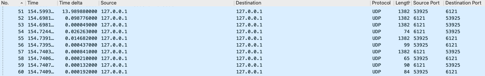

Welcome to the homepage for Chris Holland and Austin Benoit's QUIC Project for CSC 466 at UVIC.  We are both fourth-year computer science students interested in computer communications and networking, and as a course project have decided to analyze Google's QUIC protocol. In the [Contents](#contents) section below, you will find the an organized list of the pieces that make up our project. We hope you find our work as interesting as we do.

## Contents <a name="contents"></a>
* [Project Proposal](proposal.md)  
* [Project Timeline](logbook.md)
* [Log Entry 1](#log1)
* [Log Entry 2](#log2)
* [Log Entry 3](#log3)

## Log Entries
This section includes log entries of important steps, milestone, or challenges we overcame or completed during the duration of the project. We hope it provides insights into the methodology we used to approach this project.  

### Log Entry 1 <a name="log1"></a>
March 9, 2020  

We have both installed Google's Chromium project and built the source on our own machines. This will allow us to use the toy Quic server & client implementation for our expirimental purposes. Installing the software took hours, as the source code was over 40GB is size, and required detailed setup instructions in order to work properly. We decided to initially install the source on our own local machines, rather than on a cloud provider like AWS so that we could have QUIC running as soon as possible.  

Below I will outline the steps we took in order to operate the local QUIC server & client as well as song of the inital findings. Please note that I installed the code on a Mac, you can find the installation steps for all platforms [here](https://www.chromium.org/developers/how-tos/get-the-code).  

We first needed to clone the `depot_tools` repository so that we have the tools needed to run the client & server:  
```
git clone https://chromium.googlesource.com/chromium/tools/depot_tools.git
```
Once the clone was finished, we needed to add `depot_tools` as a `PATH` variable:  
```
export PATH="$PATH:/path/to/depot_tools"
```
We then needed to configure git:  
```
git config --global core.precomposeUnicode true
```
We then needed to make a directory for Chromuim (outside of the directory for depot_tools):  
```
mkdir chromium && cd chromium
```
We then ran the `fetch` command (installed as part of depot_tools) in the chromium directory to check out (download) the chromium code:  
```
fetch chromium
```
This installation took nearly 2 hours, which was a real drag. But eventually it finished and we navigated into the repository to build a directory for the QUIC client and server:  
```
cd src
gn gen out/Default
```
It was finally time to build the QUIC server and client, in the `chromium/src` directory, we ran:  
```
ninja -C out/Default quic_server quic_client
```
The build took a little while, but once it was finished we had a working QUIC client and server to run on our own machines!  

### Log Entry 2 <a name="log2"></a>
March 17, 2019  

This log entry is slightly late, but details the steps we took to get toy QUIC server and client up and running on our own machines (a continuation of the steps from Log Entry 1).  

Now that we had the Chromium project installed, we could build the QUIC client and server using the following command while in `chromium/src`.  
```
ninja -C out/Default quic_server quic_client
```
The server and client took a few minutes to build, and once complete we used the following commands to create a directory to store sample data for the server to send to the client. We used the simple website [example.org](www.example.org).  
```
mkdir /tmp/quic-data
cd /tmp/quic-data
wget -p --save-headers https://www.example.org
```
Once finished, we were able to run the client and server, and request the example.org data that we downloaded! Firstly we ran the server:  
```
sudo ./out/Default/quic_server --quic_response_cache_dir=/tmp/quic-data/www.example.org --certificate_file=net/tools/quic/certs/out/leaf_cert.pem --key_file=net/tools/quic/certs/out/leaf_cert.pkcs8
```
And then we ran the server and made the request:  
```
sudo ./out/Default/quic_client --host=127.0.0.1 --port=6121 --disable_certificate_verifications https://www.example.org
```

### Log Entry 3 <a name="log3"></a>
March 17, 2019  

Now that the QUIC server and client is running and able to handle requests, we decided to take a look at the packets in Wireshark. Please note that currently the members of our group are experiencing various technical difficultes that may include the number of packets being transferred for the requests to vary, or the requests returning a 404. However, here is the packet capture for a simple requestion as explained in Log Entry 3.  



#### Observations
* As we can see, the client port is `6121` as stated in Log Entry 2, and the server defaulted to port `53925`.
* For some reason, the first packet in the sequence originated from the server, this is likely a configuration error that we will further investigate.
* The entire exchange is 10 packets.
* Wireshark capture the QUIC traffic as UDP.